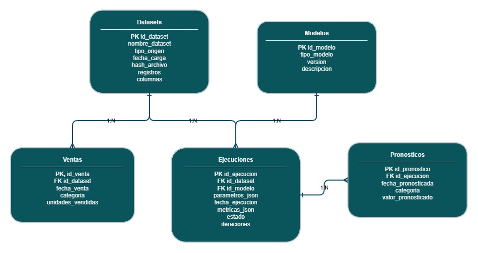

# Sistema de apoyo a la toma de decisiones empresariales mediante modelos de pronóstico automatizado de ventas
## Equipo 15 - Master en Big Data & Business Intelligence

- Francisco Javier Robles Guevara 
- Marina Palhares Telles Claro 
- Stephany Maria Solano Salas
- Tessa Veronica Yañez Alonso

## Sobre este repositorio:
Este repositorio contiene el MVP (Producto Mínimo Viable) del Trabajo de Fin de Máster (TFM), cuyo objetivo es construir una aplicación local para la predicción de demanda/ventas mediante modelos de forecasting, integrando:

- Ingesta de datos
- Persistencia en base de datos
- Pipeline de modelado
- Generación de predicciones
- Visualización interactiva

La aplicación está desarrollada en Python, utiliza Streamlit como interfaz y SQLite como sistema gestor de base de datos.

## Estructura del repositorio
En este repositorio se encontrará el código desarrollado relacionado con nuestro proyecto
- En la carpeta [API]([https://pages.github.com/](https://github.com/roguef07/TFM_Equipo_15/tree/main/API)) se encuentra todo lo relacionado al proceso de conectar con el API de Kaggle para obtener información relevante a analizar para generar el modelo predictivo de nuestro proyecto.
- En la carpeta [forecast_app] ([https://pages.github.com/](https://github.com/roguef07/TFM_Equipo_15/tree/main/forecast_app)) se encuentra los modulos que pertenecen a nuestro MVP.
- En la carpet [doc/diagramas] ([https://pages.github.com/](https://github.com/roguef07/TFM_Equipo_15/tree/main/doc/diagramas)) se puede encontrar el diagramado respectiivo al modelo de datos, tanto como sus editables como la imagen del modelo.

## Requisitos previos

Antes de ejecutar la aplicación, es necesario contar con:

* Python **3.9 o superior**
* pip
* Entorno virtual (recomendado)

---

## Instalación

### Clonar el repositorio

```bash
git clone <url-del-repositorio>
cd <nombre-del-repo>
```

---

### Crear entorno virtual (opcional pero recomendado)

```bash
python -m venv venv
```

Activar el entorno:

**Windows:**

```bash
venv\Scripts\activate
```

**Linux/Mac:**

```bash
source venv/bin/activate
```

---

### Instalar dependencias

```bash
pip install -r forecast_app/requirements.txt
```

---

## Ejecución de la aplicación

Una vez instaladas las dependencias, ejecutar:

```bash
streamlit run forecast_app/app.py
```

Esto abrirá automáticamente la aplicación en el navegador web.

---

## Uso del dataset de ejemplo

En el repositorio se incluye un archivo:

```
data/ejemplo.csv
```

Este archivo puede usarse directamente desde la interfaz de Streamlit como **dataset de prueba**, permitiendo:

* Probar la ingesta de datos
* Ver la persistencia en SQLite
* Ejecutar el pipeline de predicción
* Visualizar resultados

No es necesario cargar datos externos para la evaluación del proyecto.

---

## Flujo de funcionamiento

1. El usuario interactúa con la interfaz Streamlit
2. Se cargan los datos (CSV)
3. Los datos son procesados por el módulo de ingesta
4. Se almacenan en SQLite
5. Se ejecuta el modelo predictivo
6. Las predicciones se persisten en la base de datos
7. Los resultados se visualizan en la aplicación

---

## Modelo de datos

El modelo de datos funcional del sistma es el siguiente, donde se tiene la interacción entre los distintos datasets, los modelos de predicción y la obtenciión de los resultados:


---


> [!NOTE]
> Work in progress.
